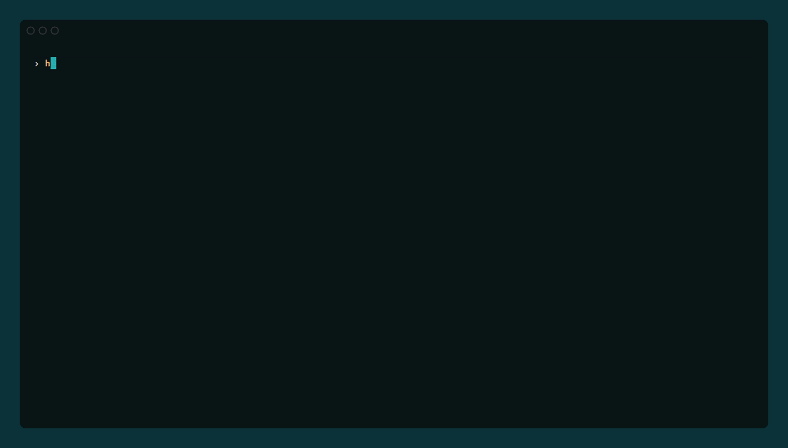
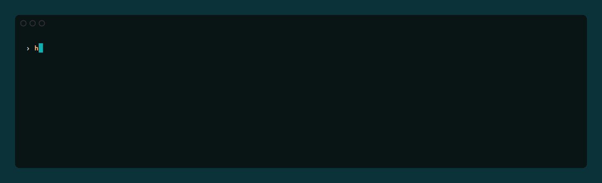
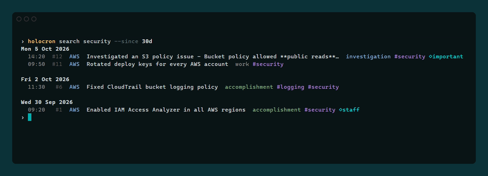
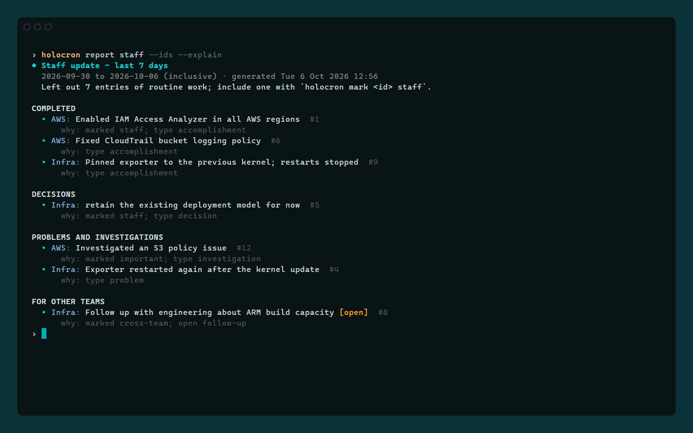
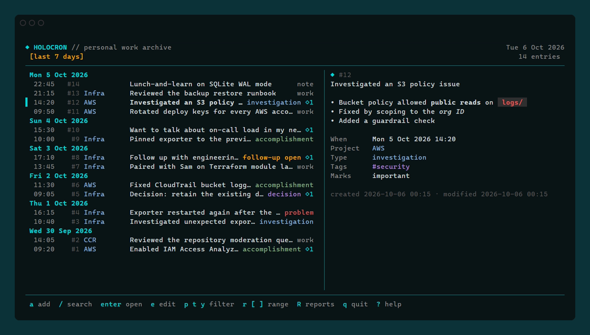

# Holocron

**Holocron is your personal work archive.**

During a working day you do dozens of small and medium things: investigate
problems, make decisions, finish work across several projects. By the time you
need a weekly update, a one-on-one, a quarterly review, or an answer to "what
did I do last Tuesday?", that context is scattered across Git history, chat,
tickets and memory.

Holocron makes capturing that context cheap enough to actually do it, keeps it
in a local SQLite file you own, finds it again with full-text search, and turns
it into deterministic reports that always show which entries they came from.



- **Local first.** No account, no server, no telemetry. Nothing leaves your
  machine unless you explicitly ask for AI rewriting of a report.
- **Fast capture.** `holocron add "Fixed the deployment issue +infra #deploy"`.
- **Search that works.** SQLite FTS5 over text, projects and tags, combined
  with date, project, tag, type and mark filters.
- **Useful reports without AI.** Day, week, staff, one-on-one and quarterly
  reports built from explicit metadata, each item traceable to its entries.
- **Your data is not trapped.** Markdown and versioned JSON export, verified
  online backups, and a documented schema.

## Contents

- [Install](#install)
- [Quick start](#quick-start)
- [Capturing entries](#capturing-entries)
- [Browsing and searching](#browsing-and-searching)
- [Editing, marking, resolving and deleting](#editing-marking-resolving-and-deleting)
- [Projects and tags](#projects-and-tags)
- [Reports](#reports)
- [The interactive archive (TUI)](#the-interactive-archive-tui)
- [Export](#export)
- [Backup and restore](#backup-and-restore)
- [Git import](#git-import)
- [AI-assisted reports (optional)](#ai-assisted-reports-optional)
- [Configuration and storage locations](#configuration-and-storage-locations)
- [Diagnostics](#diagnostics)
- [Shell completion](#shell-completion)
- [Scripting](#scripting)
- [Privacy and security](#privacy-and-security)
- [Licence](#licence)

## Install

Holocron is a single static binary for Windows, macOS and Linux (amd64 and
arm64). It needs no C toolchain and no runtime dependencies.

**From a release:** download the archive for your platform from the releases
page, extract `holocron` (or `holocron.exe`) and put it on your `PATH`.

**With Go 1.27 or later:**

```bash
go install github.com/Unscheduled-Maintenance/Holocron/cmd/holocron@latest
```

**From source:**

```bash
git clone https://github.com/Unscheduled-Maintenance/Holocron
cd holocron
go build ./cmd/holocron
```

The archive is created automatically the first time you use it.

## Quick start

```bash
holocron add "Investigated an S3 policy issue" --project aws --type investigation --tag security
holocron add "Decision: retain the existing deployment model for now +infra"
holocron today
holocron search s3
holocron report staff
holocron
```

Running `holocron` with no arguments in a terminal opens the interactive
archive. Everything it does is also available from the command line.

## Capturing entries

The simplest form is all you need:

```bash
holocron add "Fixed the deployment issue"
```



Text can also come from stdin, which makes Holocron easy to call from other
tools:

```bash
echo "Fixed the deployment issue" | holocron add
```

### Metadata

Every entry may have a project, a type, tags and report marks. All of them
are optional.

| Flag | Meaning |
|---|---|
| `-p, --project NAME` | Project name or alias. Unknown projects are created on first use (Holocron tells you). |
| `--type TYPE` | One of `work`, `accomplishment`, `decision`, `investigation`, `problem`, `follow-up`, `note`. Unique prefixes and [aliases](#type-aliases) work: `--type dec`, `--type win`. |
| `-t, --tag TAG` | Repeatable or comma-separated. Tags are lower-cased and may contain letters, digits, `-`, `_`, `.`, `/` and `:`. |
| `--mark MARK` | Report mark: `staff`, `one-on-one`, `quarterly`, `important`, `cross-team` (see [Reports](#reports)). |
| `--resolves ID` | Resolve an open problem or follow-up and link it to this entry (see [Editing, marking, resolving and deleting](#editing-marking-resolving-and-deleting)). Repeatable. |
| `--at WHEN` | When it happened: `14:30`, `2:30pm`, `yesterday 16:00`, `2026-10-02 09:15`, `-2h`, `90m ago`. A date without a time means noon. Default: now. |
| `-e, --editor` | Write the entry in your editor. |
| `--raw` | Store the text exactly as given (no shorthand parsing). |
| `--json`, `-q` | Print the saved entry as JSON, or only its ID. |

### Entry types

A type says what kind of record an entry is. It's optional, but it's what
lets reports pick out the entries that matter. Set it with `--type`, a
`Type:` prefix (see [Shorthand](#shorthand)), or the Type field in the TUI.

| Type | When to use |
|---|---|
| `accomplishment` | Something finished, shipped or fixed that you'd mention to others. Leads the staff update (Completed), the one-on-one (Wins) and the quarterly report. |
| `decision` | A choice made, ideally with the reason. Gets its own Decisions section in the staff, one-on-one and quarterly reports. |
| `problem` | Something broken, blocking or going wrong. Appears under Problems in the staff update, and stays **open** until resolved: open problems carry into every one-on-one report until then. |
| `follow-up` | Something to do, chase or check later. Stays **open** until resolved; open follow-ups appear under Coming up (staff) and Open follow-ups (one-on-one). |
| `investigation` | Digging into something before you know the answer. Kept out of the staff update unless marked; repeated investigations on the same tag or project show up as recurring friction in the one-on-one report. |
| `work` | Routine progress: reviews, maintenance, steady work on a task. Counted in week and quarter summaries, but left out of the staff update unless marked. |
| `note` | Context worth keeping that isn't work: meetings, ideas, things learned. Ranked lowest; never in the staff update unless marked. |
| *(none)* | Anything you don't want to classify. Treated much like `work`. |

Mark a problem or follow-up done with `holocron resolve <id>` (or `x` in the
TUI). Any entry can be pulled into a report regardless of type with a
[report mark](#report-marks).

### Type aliases

Aliases are shorthand for a type. Two are built in: `win` for
`accomplishment` and `look` for `investigation`. They work anywhere you type
a type: `holocron add "Win: rotated the keys"`, `--type look`, filters such
as `holocron list --type win`, and the editor form's `type` field. Entries
always store and show the real type, so listings, reports and exports never
see the alias.

Add your own, or remove a built-in one, in the
[configuration file](#configuration-and-storage-locations):

```toml
[type_aliases]
ship = "accomplishment"
look = ""                    # removes the built-in alias
```

Aliases are matched exactly and ignore letter case. An alias may contain
letters, digits, `-` and `_`, and may not be a type name. `holocron config
show` and `holocron doctor` list the aliases in effect.

### Shorthand

Inside the entry text, `+project` and `#tag` set metadata quickly:

```bash
holocron add "Fixed S3 bucket policy +aws #security"
holocron add "+aws #security Fixed S3 bucket policy"
holocron add "Patched #security hole in the +aws account"
```

The rules are deliberately simple and predictable:

- A shorthand token is a word starting with `+` or `#` followed by a letter.
  `#123`, `C#` and `+1` are ordinary text.
- Tokens at the start or end of the text are removed from it. Tokens in the
  middle keep their word without the sigil, so the third example is stored as
  "Patched security hole in the aws account".
- Only one `+project` is allowed per entry.
- Text that begins with a type and a colon gets that type, and the prefix is
  removed: `Decision: keep weekly deploy windows` is stored as the decision
  "keep weekly deploy windows". This works for every type (`Work:`,
  `Accomplishment:`, `Decision:`, `Investigation:`, `Problem:`, `Follow-up:`,
  `Note:`), in any letter case, and for [type aliases](#type-aliases):
  `Win: shipped it` is stored as the accomplishment "shipped it". If
  `--type` names a different type, the prefix is treated as ordinary text
  and kept.

> **Quote text that contains `#`.** Bash, Zsh and PowerShell treat an unquoted
> word starting with `#` as a comment and silently drop it. Inside quotes it is
> safe. Use `--tag` if you prefer flags, and `--raw` to switch shorthand off
> for one entry (or `capture.shorthand = false` in the config).

### Focused capture

```bash
holocron now          # a one-line prompt: type, Enter to save, Esc to cancel
holocron now --editor # write the entry in $VISUAL / $EDITOR
holocron add          # with no text at a terminal, opens the same prompt
```

The editor form is a short document: fields (`time`, `project`, `type`,
`tags`, `marks`) above a `---` line and the entry text below it.

Handy shell aliases (not required):

```bash
alias h='holocron'
alias hn='holocron now'
alias ha='holocron add'
```

## Browsing and searching

```bash
holocron today            # today's entries, oldest first
holocron yesterday
holocron week             # this week (Monday start by default)
holocron list             # newest first, 50 at a time
holocron show 42          # one entry in full (also "#42" or its UID)
```

Entries are stored exactly as typed. `show` renders Markdown in the text
when writing to a terminal, and prints it unchanged when piped.

Every listing accepts the same filters:

| Flag | Meaning |
|---|---|
| `-r, --range EXPR` | A whole period: `today`, `yesterday`, `7d`, `30d`, `2w`, `3m`, `this-week`, `last-week`, `this-month`, `last-month`, `this-quarter`, `last-quarter`, `this-year`, `last-year`, `YYYY-MM-DD`, `YYYY-MM`, `YYYY-Qn`, `all` |
| `--since EXPR` | Open-ended: from the start of `EXPR` until now, e.g. `--since 30d` |
| `--from DATE`, `--to DATE` | Inclusive calendar days, e.g. `--from 2026-09-01 --to 2026-09-30`. Each also accepts a range expression (`--from last-month` starts on the first day of last month). |
| `-p, --project NAME` | Any of these projects (repeatable). `-` means "no project". |
| `-t, --tag TAG` | Entries with **all** of these tags. |
| `--type TYPE` | Any of these types. |
| `--mark MARK` | Entries with any of these marks. |
| `--open` | Only unresolved problems and follow-ups. |
| `-n, --limit N` | Maximum results (`0` for no limit). |
| `--reverse` | Reverse the order. |
| `--json` | Machine-readable output. |

**Date ranges are inclusive of whole days** in your local timezone: `--to
2026-09-30` includes everything on 30 September. `7d` means the last seven
days *including today*. Weeks start on Monday unless `week_start = "sunday"`
is configured.

### Full-text search

```bash
holocron search cloudtrail
holocron search "access analyzer" --since 30d
holocron search --project aws --type decision
holocron search 'exporter restart -cloudflare'
holocron search "bucket +aws #security"
holocron search --tag security --from 2026-09-01 --to 2026-09-30
```



Search covers entry text, project names and aliases, and tags:

| Syntax | Meaning |
|---|---|
| `word` | Words beginning with `word`, case- and accent-insensitive. Common English endings are relaxed, so `investigating` also finds `investigated`. |
| `"exact phrase"` | The words in that order (quote it for your shell as well). |
| `-word` | Exclude entries containing `word`. |
| `a OR b` | Either term. Terms are otherwise combined with AND. |
| `+project`, `#tag` | Filter by project or tag, as in capture shorthand. |

Results are newest first and show the matching fragment, highlighted at a
terminal. `--sort relevance` ranks by match quality instead.

## Editing, marking, resolving and deleting

```bash
holocron edit 42                                    # opens your editor
holocron edit 42 --type decision --tag architecture # or change fields directly
holocron edit 42 --text "New wording" --at "09:10"
holocron edit 42 --untag draft --no-project

holocron mark 42 staff important                    # report marks
holocron unmark 42 staff
holocron unmark 42 all

holocron resolve 42                                 # close a problem or follow-up
holocron resolve 42 --reopen

holocron delete 42                                  # asks first
holocron delete 42 43 --yes                         # scripts must pass --yes
```

Entry numbers are never reused, even after deletion or a restore, so `#42`
written in a ticket last year can never silently point to a different entry.

Problems and follow-ups are *open* until resolved. Open items appear in the
staff and one-on-one reports and in `holocron list --open`.

When the resolution is itself worth recording, capture it with `--resolves`
instead of `holocron resolve`:

```bash
holocron add "Engineering approved the ARM capacity" --resolves 42
```

This saves the new entry, resolves #42 at the new entry's time and links the
two: `holocron show 42` says "resolved … by #57", and `holocron show 57`
lists what it resolves. In reports the new entry reads "Engineering approved
the ARM capacity (resolves #42: ask about ARM capacity)" and cites both
entries, and it counts as completed work in the staff update and as a win in
the one-on-one whatever its type. `--resolves` is repeatable, works with
`holocron now` and `add --editor`, and refuses an item that is already
resolved (nothing is saved). `holocron resolve 42 --reopen` removes the link.

## Projects and tags

Projects are lightweight context, not a task manager. They are created the
first time you use one, and can have aliases for faster capture:

```bash
holocron project add "Chocolatey Infrastructure" --alias infra --alias ops --description "Servers and CI"
holocron add "Rotated deploy keys +ops"       # stored under Chocolatey Infrastructure
holocron project list                          # most recently active first
holocron project show infra                    # details and recent entries
holocron project edit infra --name "Infra Platform" --path ~/src/infra --url https://example.com
holocron project archive infra                 # hide from lists; entries are kept
holocron project unarchive infra
holocron project delete infra                  # entries are kept without a project
```

Repository paths (`--path`) connect a project to Git repositories for
[Git import](#git-import).

```bash
holocron tag list                  # tags with usage counts
holocron tag rename sec security   # renames everywhere, merging if needed
```

## Reports

All reports are deterministic: no AI is involved unless you pass `--ai`.
Selection uses explicit metadata (type, marks, resolution, project, tags)
and a few documented heuristics. Every item knows which entries it came
from: `--ids` shows their numbers and `--explain` shows *why* each item was
included.

```bash
holocron report day                        # today, chronological
holocron report day --date yesterday
holocron report week                       # this week, grouped by project
holocron report staff                      # concise team update (this week)
holocron report staff --range last-week --explain
holocron report one-on-one                 # last 14 days
holocron report quarter --range 2026-Q3
holocron report staff --format markdown -o staff.md
holocron report week --format json
```



| Report | Default range | What it shows |
|---|---|---|
| `day` | today | Chronological timeline, then anything still open. |
| `week` | this week | One section per project, most significant work first; routine entries beyond the section limit are counted, not listed; open items last. |
| `staff` | this week (last week on the first day of the week; see [below](#timing-the-staff-update)) | Completed work, decisions, problems and investigations, what's coming up, and items for other teams. Routine work and notes are left out (with a count) unless marked. |
| `one-on-one` | last 14 days | Items marked for discussion, wins, decisions, open problems and follow-ups (looking back 90 days), and *recurring friction*: tags or projects with two or more problems or investigations. |
| `quarter` | this quarter | Per project: how many weeks it was active, accomplishments, decisions and marked items, plus a count of routine work; recurring themes from tags. |

Common report options: `--range/--since/--from/--to`, `-p/--project`,
`-f/--format text|markdown|json`, `-o/--output FILE`, `--ids`, `--explain`,
`--max N` (items per section).

### Timing the staff update

The staff update is often written at the start of the week, about the week
that just finished. So when its default range is `this-week` and you run it
on the first day of the week, it covers *last* week instead and says so at
the top. `reports.staff_early_days` sets how many days count as early (`1` by
default, `0` turns it off), and any `--range`, `--since`, `--from` or `--to`
wins.

To cover exactly what is new since the last update you sent, record the
report when you send it, and start the next one from there:

```bash
holocron report staff --record             # remember this update as sent
holocron report staff --since last         # everything since then
```

`--since last` starts where the last recorded report of the same kind ended,
or when it was recorded if that is earlier (a this-week update sent on
Wednesday covers nothing after Wednesday). It works for every report kind,
each remembering its own, and can be combined with `--to`. Generating a
report never records it unless you pass `--record`, and an `--ai` report is
recorded only once it is actually delivered.

### Report marks

Marks are explicit signals that an entry belongs in a report. They are
separate from tags on purpose: a tag describes *what* an entry is about; a
mark says *where it should go*. Tagging something `#staff` has no special
effect; marking it `staff` does.

| Mark | Effect |
|---|---|
| `staff` | Included in the staff update and ranked first in its section. |
| `one-on-one` | Listed under *To discuss* in the one-on-one report. |
| `quarterly` | Featured in the quarterly report. |
| `important` | Ranked above other items in every report. |
| `cross-team` | Gets its own *For other teams* section in the staff update. |

Mark while capturing (`--mark staff`) or later (`holocron mark 42 staff`).

### How items are chosen

- Types rank `accomplishment` > `decision` > `problem` > `follow-up`,
  `investigation`, `work` > untyped > `note`; marks outrank types.
- Three or more unmarked imported records (for example commits) from one
  source in a section are summarised as one item ("7 commits imported from
  git"), still listing every source entry.
- Sections are capped (`reports.max_items`, default 8); omissions are always
  stated, never silent.
- Counts appear only where they mean something: active days in a week, active
  weeks per project in a quarter, routine entries left out.

## The interactive archive (TUI)

Run `holocron` (or `holocron tui`) in a terminal. The list opens on this week
by default, newest first. Wide terminals (110 columns or more) show the
selected entry beside the list; narrow ones open it on Enter. The layout
adapts down to 30×8.



| Keys | Action |
|---|---|
| `↑` `↓` / `j` `k` | Move |
| `PgUp` `PgDn`, `Home` `End` / `g` `G` | Page, first, last |
| `Enter` | Open the full entry (`n`/`N` for next/previous inside it) |
| `a` | Quick add (shorthand works) |
| `A` | Add with every field in a form |
| `e` | Edit in a form (`Tab` between fields, `Ctrl+S` saves) |
| `E` | Edit in `$VISUAL`/`$EDITOR` |
| `d` | Delete (asks `y`/`n`) |
| `u` | Undo the last delete |
| `m` | Report marks (space toggles, Enter applies) |
| `x` | Resolve or reopen a problem or follow-up |
| `/` | Search as you type (Enter keeps it, Esc cancels) |
| `p` `t` `y` | Filter by project, tag, type (type to narrow the list) |
| `o` | Only open problems and follow-ups |
| `r` | Choose a date range; `[` `]` step to the previous/next period |
| `R` | Generate a report: `Tab` cycles kinds, `[` `]` change period, `i` shows entry IDs, `w` shows why items appear, `s` saves Markdown |
| `Ctrl+R` | Reload (after changes made from the CLI) |
| `?` | Keyboard help |
| `q` | Quit (from the list) · `Ctrl+C` quits from anywhere |

**Esc always means "back one level"**: it closes the open dialog or input; with
none open it leaves the entry or report screen; on the main list it clears
active filters. It never quits. A form with unsaved changes asks you to press
Esc a second time before discarding them.

In Windows Terminal, Holocron switches the console to win32-input mode while
it runs, so Esc responds as quickly as any other key (other Windows hosts
make every Esc wait about 50 ms to rule out an arrow-key sequence). It is
switched off again on exit and while your editor is open. Set
`HOLOCRON_LEGACY_INPUT=1` to disable it.

Entry text is rendered as Markdown in the detail view (emphasis, lists, code,
headings), using a dark or light palette to match your terminal. List rows
show the text as typed. Raw HTML is never interpreted, so text such as
`Vec<T>` or `<script>` is always shown.

Active filters are always written out in the header (`project: AWS`,
`tag: #security`), the selected row has a `▌` marker, and open items say
`open`, so nothing depends on colour alone.

## Export

```bash
holocron export --format markdown -o holocron.md
holocron export --format json -o holocron.json
holocron export --since 30d
holocron export --project aws --format markdown
```

Export accepts every listing filter. Entries are written oldest first.

- **Markdown** is grouped by month and day and readable without Holocron: each
  entry shows its time and text, then its ID, project, type (with open or
  resolved status), tags, marks and source.
- **JSON** has a versioned structure (`"format": "holocron.export/v1"`)
  documented in [docs/export-format.md](docs/export-format.md). Times are UTC
  RFC 3339, and each entry also records the local time it was captured. The
  same entry shape is used by every `--json` option.

## Backup and restore

```bash
holocron backup                               # to the backups folder
holocron backup --output ~/backups/holocron.db
holocron backup -o /mnt/usb/                  # a directory: timestamped name
holocron restore ~/backups/holocron-20261005-090000.db
```

`backup` uses SQLite's `VACUUM INTO`, which produces a consistent, compact copy
even while Holocron is running elsewhere (a plain file copy of a live SQLite
database with a write-ahead log is not safe). The copy is integrity-checked
before the command reports success, and an existing file is never
overwritten.

`restore` refuses anything that is not an intact Holocron archive, shows what
it is about to replace, and asks for confirmation (`--force` when not at a
terminal). Before replacing anything it saves the current archive as
`holocron-pre-restore-<time>.db` in the backups folder, so a restore can be
undone by restoring that file. Backups from older Holocron versions are
migrated after restoring. Close any running TUI before restoring.

Holocron also takes an automatic backup (`holocron-pre-migration-v<N>-<time>.db`)
before upgrading an existing archive to a newer schema.

**Manual recovery.** The archive is an ordinary SQLite 3 file. If Holocron
cannot open it:

1. Stop all Holocron processes.
2. Copy `holocron.db` together with `holocron.db-wal` and `holocron.db-shm`
   (if present) somewhere safe.
3. Run `holocron doctor`, or open the copy with the `sqlite3` shell and run
   `PRAGMA integrity_check;`. `.recover` in the `sqlite3` shell can salvage
   rows from a damaged file.
4. Restore the most recent good backup with `holocron restore`, or point
   Holocron at a copy with `--db`.

## Git import

```bash
holocron import git --since 7d                 # the current repository
holocron import git --repo ~/src/infra --repo ~/src/site --since last-week
holocron import git --projects --since 30d     # every project repository path
holocron import git --since yesterday --dry-run
holocron import git --since yesterday --yes    # no prompt
```

Holocron runs your installed `git` to find non-merge commits on local
branches authored by you (git's `user.email` in each repository, plus
`git.author_emails` in the config and any `--author`). At a terminal you
choose commits from a checklist (all selected; `space` toggles, `a` toggles
all, `Enter` imports, `Esc` cancels). Without a terminal the candidates are
listed and nothing is imported unless `--yes` is given.

Imported entries are `work` entries whose text is the commit subject and
whose time is the author date. Each keeps its provenance: source `git`, the
full commit hash, a link when the remote is on GitHub, GitLab or Bitbucket,
and the import time (`holocron show` displays it). Re-running an import never
creates duplicates. Entries get the project whose repository path contains
the repository, or `--project`.

## AI-assisted reports (optional)

AI is entirely optional, off by default, and never needed to retrieve, export
or summarise your records.

```bash
holocron report staff --ai
holocron report week --ai -o week.md
```

With `--ai`, Holocron first builds the normal deterministic report, then
sends **only the entries that report selected** (their full text, project,
type and tags) to the configured provider and asks for a tidier write-up that
cites entry IDs like `[#12]`. It never sends the rest of the archive and the
model never searches it. Before anything is sent you are told how many
entries, which IDs, and which provider; you must confirm (`--yes` when not at
a terminal). The result ends with a **Sources** list showing every selected
entry, whether the text cited it, and a warning if it cited anything that was
not supplied. With `-o`, you see the text and confirm before it is written.
If the provider fails or declines, Holocron prints the deterministic report
instead and exits non-zero.

Set it up in the config file (`holocron config edit`):

```toml
[ai]
provider = "anthropic"
model = "claude-opus-5-5"          # optional; this is the default
api_key_env = "ANTHROPIC_API_KEY"  # optional; the variable holding the key
```

The API key is read only from that environment variable. It is never stored
in the archive, the config file or logs. `holocron doctor` reports whether the
key is present without printing it.

## Configuration and storage locations

Holocron works without a configuration file. `holocron config path` shows
where everything lives:

| | Windows | macOS | Linux |
|---|---|---|---|
| Config | `%APPDATA%\holocron\config.toml` | `~/Library/Application Support/holocron/config.toml` | `$XDG_CONFIG_HOME/holocron/config.toml` (`~/.config/…`) |
| Archive | `%LOCALAPPDATA%\holocron\holocron.db` | `~/Library/Application Support/holocron/holocron.db` | `$XDG_DATA_HOME/holocron/holocron.db` (`~/.local/share/…`) |
| Backups | `…\holocron\backups\` next to the archive | same | same |

On Windows the archive lives in the *local* (non-roaming) profile, because
SQLite files and roaming-profile sync do not mix.

Overrides, highest priority first: `--db PATH` / `--config PATH` flags; the
`HOLOCRON_DB`, `HOLOCRON_CONFIG` and `HOLOCRON_DATA_DIR` environment
variables; `database = "..."` in the config file.

```bash
holocron config path    # file locations
holocron config show    # effective settings (defaults plus your file)
holocron config edit    # open the file in your editor, creating it with comments
```

Settings (all optional):

```toml
database = "~/holocron/holocron.db"
editor = "code --wait"       # overrides $VISUAL / $EDITOR for Holocron
week_start = "monday"        # or "sunday"
clock = "24h"                # or "12h"

[capture]
shorthand = true             # +project / #tag parsing
create_projects = true       # create unknown projects on first use

[type_aliases]               # shorthand for entry types (see Type aliases)
win = "accomplishment"       # built in
look = "investigation"       # built in; set to "" to remove

[reports]
max_items = 8
staff_range = "this-week"
staff_early_days = 1         # on the first day of the week, staff covers last week (0 = off)
one_on_one_range = "14d"
open_lookback = "90d"        # how far back open problems and follow-ups are collected

[tui]
default_range = "this-week"

[git]
author_emails = ["me@example.com"]

[ai]
provider = ""                # "anthropic" to enable --ai
model = ""
api_key_env = ""
base_url = ""                # optional proxy or gateway
```

Unknown settings are reported as errors rather than ignored. The editor is
chosen from `editor`, then `$VISUAL`, then `$EDITOR`, then `notepad` on
Windows or `editor`/`nano`/`vi` elsewhere. Editor commands may include
arguments and quoted paths (`"C:\Program Files\Editor\ed.exe" --wait`).

Times are stored in UTC and shown in your local timezone (`--utc` shows UTC).
Each entry also records the UTC offset where it was captured, so the original
wall-clock time survives travel and daylight-saving changes.

## Diagnostics

```bash
holocron doctor
holocron doctor --rebuild-index
holocron doctor --json
```

`doctor` checks the config file, database integrity, schema version, FTS5
availability, that the search index matches the entries, backups, the
editor, `git`, and AI configuration. It never migrates or modifies the archive
(except with `--rebuild-index`, which regenerates the search index), and its
output never includes entry text.

## Shell completion

Completion is optional. Holocron completes commands, flags, project names,
tags, entry IDs, types, marks and range expressions.

```bash
# Bash (current session; add to ~/.bashrc to keep)
source <(holocron completion bash)

# Zsh (once; ensure compinit runs in ~/.zshrc)
holocron completion zsh > "${fpath[1]}/_holocron"

# Fish
holocron completion fish > ~/.config/fish/completions/holocron.fish
```

```powershell
# PowerShell (add to $PROFILE to keep)
holocron completion powershell | Out-String | Invoke-Expression
```

## Scripting

- Output written to a pipe or file contains no colour or decoration;
  `--color always|never` overrides detection and `NO_COLOR` is honoured.
- Hints and confirmations go to stderr; data goes to stdout.
- `--json` is available on `add`, `list`, `today`, `week`, `yesterday`,
  `search`, `show`, `edit`, `mark`, `project list/show`, `tag list`,
  `backup`, `doctor`, `config path` and `import git`; reports and exports use
  `--format json`.
- Destructive commands never prompt without a terminal: `delete` needs
  `--yes`, `restore` needs `--force`.

Exit codes:

| Code | Meaning |
|---|---|
| 0 | Success |
| 1 | Something failed (database, filesystem, network, failed check) |
| 2 | Invalid usage or input (unknown flag, bad date, unknown type, missing confirmation) |
| 3 | Not found (entry, project or tag) |
| 130 | Interrupted |

## Privacy and security

- Holocron never contacts a network service on its own. There is no
  telemetry, update check or crash reporting.
- Data leaves your machine only when you run `holocron report … --ai` with a
  configured provider, and only the entries that report selected, after you
  confirm. Git import runs your local `git` and makes no network calls.
- **The archive is not encrypted.** It is a plain SQLite file created with
  owner-only permissions (0600 on macOS/Linux; on Windows it inherits your
  profile's ACLs). Protect it with full-disk encryption (BitLocker, FileVault,
  LUKS) if your entries are sensitive, and treat backups and exports the same
  way.
- API keys are read only from environment variables and are never written to
  the archive, the config file or diagnostics.
- Diagnostics and error messages do not reproduce entry text.

## Licence

Holocron is released under the [MIT Licence](LICENSE).
